# ⚙️ ToolWear.AI

## AI-Powered CNC Cutting Tool Wear Prediction, Explainability & Prognostics

<p align="center">

  <strong>ToolWear.AI</strong>

  <br>

  <em>
    Multimodal Artificial Intelligence for CNC Tool-Wear Prediction,
    Health Monitoring and Predictive Maintenance
  </em>

  <br><br>

  
  
  
  
  
  

</p>

<p align="center">

  <a href="https://github.com/om-bhinsara/cutting-tool-wear-prediction-sih">
    
  </a>

  <a href="https://youtu.be/e6yPnD5TcGQ?si=Bip5dLqUV19i1lYC">
    
  </a>

</p>

---

# 📖 Table of Contents

- [About the Project](#-about-the-project)
- [Project Highlights](#-project-highlights)
- [Problem Statement](#-problem-statement)
- [Why Tool Wear Prediction Matters](#-why-tool-wear-prediction-matters)
- [Proposed Solution](#-proposed-solution)
- [Core Idea](#-core-idea)
- [System Architecture](#-system-architecture)
- [End-to-End Workflow](#-end-to-end-workflow)
- [Multimodal AI Pipeline](#-multimodal-ai-pipeline)
- [Computer Vision Pipeline](#-computer-vision-pipeline)
- [Sensor Processing Pipeline](#-sensor-processing-pipeline)
- [Metadata Processing](#-metadata-processing)
- [Feature Fusion](#-feature-fusion)
- [Wear Prediction](#-wear-prediction)
- [Explainable AI](#-explainable-ai)
- [Multimodal Agreement](#-multimodal-agreement)
- [Tool Health Monitoring](#-tool-health-monitoring)
- [Remaining Useful Life](#-remaining-useful-life)
- [Wear Progression](#-wear-progression)
- [Sensor Quality Monitoring](#-sensor-quality-monitoring)
- [User Interface](#-user-interface)
- [Dashboard](#-dashboard)
- [Explainable AI Interface](#-explainable-ai-interface)
- [Wear Trajectory](#-wear-trajectory)
- [Sensor Quality](#-sensor-quality)
- [Authentication](#-authentication)
- [Dataset](#-dataset)
- [Data Preprocessing](#-data-preprocessing)
- [Training Strategy](#-training-strategy)
- [Evaluation Metrics](#-evaluation-metrics)
- [Results](#-results)
- [Ablation Study](#-ablation-study)
- [Technology Stack](#-technology-stack)
- [Project Structure](#-project-structure)
- [Backend Architecture](#-backend-architecture)
- [Frontend Architecture](#-frontend-architecture)
- [REST API](#-rest-api)
- [Installation](#-installation)
- [Backend Setup](#-backend-setup)
- [Frontend Setup](#-frontend-setup)
- [Docker Deployment](#-docker-deployment)
- [Running the Application](#-running-the-application)
- [Project Workflow](#-project-workflow)
- [Key Features](#-key-features)
- [Engineering Challenges](#-engineering-challenges)
- [Future Scope](#-future-scope)
- [Project Status](#-project-status)
- [Demo](#-demo)

---

# 🚀 About the Project

**ToolWear.AI** is an AI-powered **CNC Cutting Tool Wear Prediction and Prognostics & Health Management (PHM)** platform.

The system is designed to estimate the **flank wear of CNC cutting tools** using multiple sources of machining information.

Instead of depending only on an optical image or only on machine sensor data, ToolWear.AI combines:

- 🔬 Tool-edge optical images
- 📡 Machining sensor signals
- ⚙️ Machining parameters
- 🧠 Deep-learning feature extraction
- 🔗 Multimodal feature fusion
- 📈 Regression-based wear prediction
- 🔍 Grad-CAM explainability
- ❤️ Tool health scoring
- ⏳ Remaining Useful Life estimation
- 📊 Wear progression tracking
- 📡 Sensor quality monitoring
- 🚨 Maintenance recommendations

The objective is to move from **reactive tool replacement** toward **AI-assisted predictive maintenance**.

---

# 🌟 Project Highlights

| Capability | Description |
|---|---|
| 🧠 Multimodal AI | Combines image and sensor information |
| 👁️ Computer Vision | CNN-based tool-edge feature extraction |
| 📡 Sensor Intelligence | 1D-CNN-based signal representation |
| 📊 Regression | Continuous flank-wear prediction |
| 🔗 Feature Fusion | Learns from complementary modalities |
| 🔍 Explainable AI | Grad-CAM visual interpretation |
| 🔬 Cross-Stream Verification | Image vs sensor evidence comparison |
| ❤️ Health Score | Tool condition assessment |
| ⏳ RUL | Remaining useful machining life estimation |
| 📈 Wear Tracking | Wear progression across machining passes |
| 📡 Sensor Quality | Telemetry validation and signal health |
| 🚨 Prescriptive Maintenance | Condition-based maintenance guidance |
| 🌐 REST API | Flask inference backend |
| ⚛️ Interactive UI | React + Vite dashboard |
| 🐳 Deployment | Docker-based application deployment |
| 📤 Data Export | CSV wear trajectory export |

---

# ❗ Problem Statement

CNC cutting tools experience progressive wear during machining.

As the cutting tool wears, several problems can occur:

- Reduced machining quality
- Dimensional inaccuracies
- Increased cutting forces
- Changes in vibration behavior
- Changes in acoustic emission
- Poor surface finish
- Increased probability of tool failure
- Unexpected production downtime
- Higher maintenance cost

Traditional tool-wear monitoring may rely on:

1. Manual inspection
2. Periodic measurement
3. Single-sensor monitoring
4. Operator experience
5. Fixed maintenance intervals

These approaches can be inefficient because tool wear is a **continuous degradation process**.

The key challenge is:

> **How can we automatically estimate CNC cutting-tool wear from multiple machining signals while also providing an interpretable prediction that can support maintenance decisions?**

---

# 🏭 Why Tool Wear Prediction Matters

Tool wear directly affects manufacturing quality and machine productivity.

A tool that is replaced too early can result in:

```text
Unnecessary Tool Replacement
          ↓
Higher Tool Cost
          ↓
More Machine Downtime
```

A tool that is replaced too late can result in:

```text
Excessive Tool Wear
          ↓
Poor Machining Quality
          ↓
Tool Failure
          ↓
Production Downtime
```

The ideal objective is:

```text
              OPTIMAL MAINTENANCE POINT
                         │
                         ▼
        ┌─────────────────────────────────┐
        │                                 │
        │       Continue Operation        │
        │              ↓                  │
        │       Monitor Tool Health       │
        │              ↓                  │
        │      Predict Wear / RUL         │
        │              ↓                  │
        │     Replace at Correct Time     │
        │                                 │
        └─────────────────────────────────┘
```

ToolWear.AI aims to provide this intelligence through AI-based wear estimation.

---

# 🖥️ Visual Preview

> A quick look at the ToolWear.AI operator experience before diving into the technical architecture.

## 1. Authentication

<p align="center">
  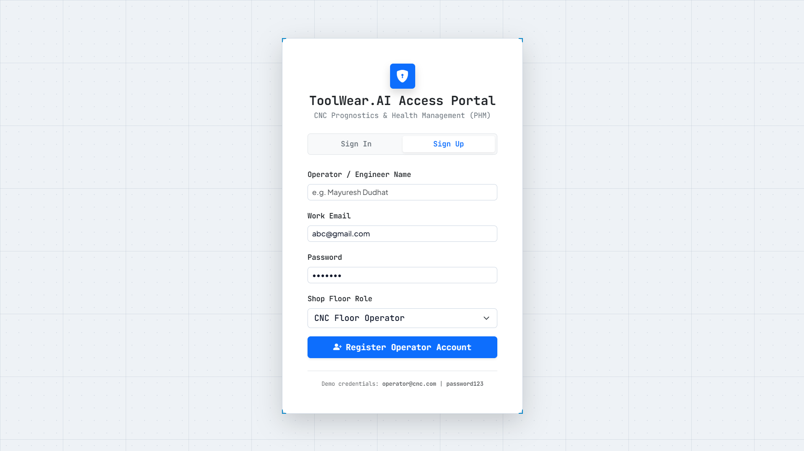
</p>

The authentication screen is the entry point to the ToolWear.AI application.

## 2. Live Dashboard

<p align="center">
  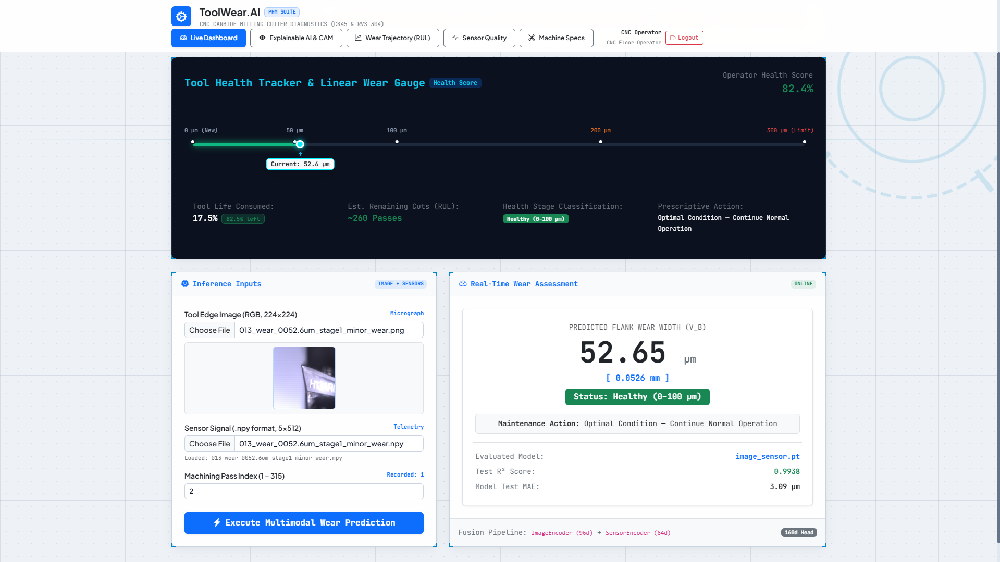
</p>

The main dashboard is the primary workspace for tool-wear inference, health assessment, remaining cuts, and maintenance guidance.

## 3. Explainable AI

<p align="center">
  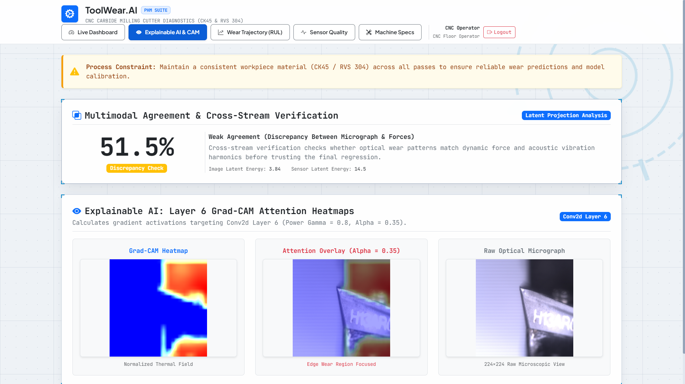
</p>

The Explainable AI view combines multimodal agreement, Grad-CAM heatmaps, attention overlays, and the original optical micrograph.

## 4. Wear Trajectory & RUL

<p align="center">
  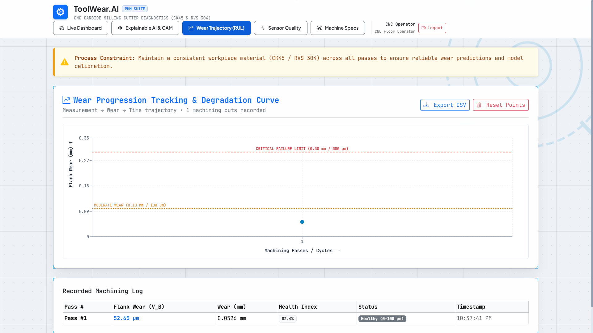
</p>

The wear trajectory view tracks degradation across machining passes and supports remaining-life analysis, thresholds, health index, and CSV export.

## 5. Sensor Quality

<p align="center">
  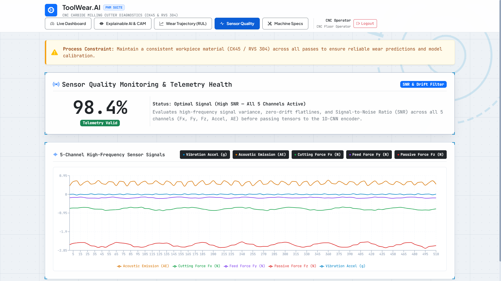
</p>

The sensor-quality view monitors telemetry health, signal quality, SNR information, and the five machining-signal channels.

---

# 🏗️ System Architecture

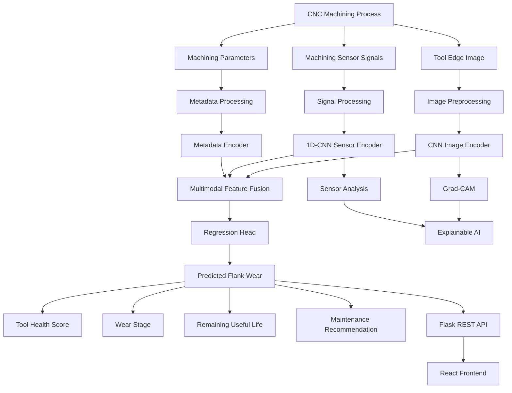

---

# 🔄 End-to-End Workflow

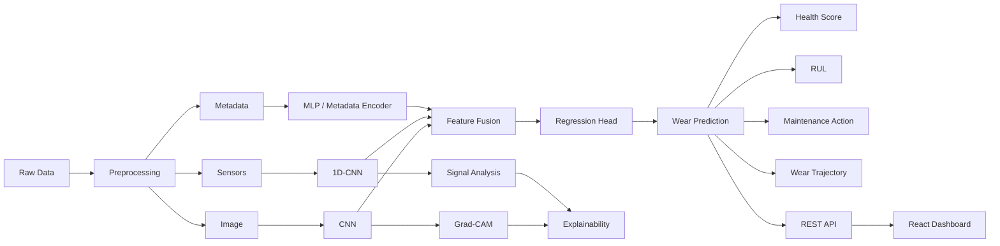

---

---

# 💡 Proposed Solution

ToolWear.AI uses a **multimodal deep-learning architecture**.

The system accepts multiple inputs:

```text
                 ┌─────────────────────┐
                 │   Tool Edge Image   │
                 └──────────┬──────────┘
                            │
                            ▼
                    Image Processing
                            │
                            ▼
                       CNN Encoder
                            │
                            │
                            ▼
                    Image Embedding
                            │
                            │
                            ├───────────────┐
                            │               │
                            ▼               ▼
                       FEATURE FUSION → REGRESSION
                            ▲               │
                            │               ▼
                            │        Flank Wear (µm)
                            │
                       Sensor Embedding
                            ▲
                            │
                    1D-CNN Sensor Encoder
                            ▲
                            │
                 Sensor Time-Series Data
```

The research architecture can additionally incorporate machining metadata.

---

# 🧠 Core Idea

The central idea is simple:

> **Different data modalities observe different aspects of tool degradation.**

### Image

The optical image provides information about the physical appearance of the cutting edge.

### Sensors

Machining sensors provide information about dynamic machine behavior.

### Machining Parameters

Machining parameters provide operational context.

Combining these sources creates a richer representation of tool condition.

```text
        IMAGE
          │
          ▼
    Visual Evidence
          │
          │
          ├──────────────┐
          │              │
          ▼              ▼
      MULTIMODAL      Wear Prediction
        FUSION             │
          ▲                ▼
          │             Health
          │                │
          │                ▼
       SENSOR            RUL
          │
          ▼
    Dynamic Evidence
```

---


# 🔬 Multimodal AI Pipeline

ToolWear.AI processes three major information sources.

## 1. Image Modality

```text
Tool Image
    ↓
Image Preprocessing
    ↓
CNN
    ↓
Image Features
```

## 2. Sensor Modality

```text
Raw Sensor Signals
       ↓
Signal Validation
       ↓
Normalization
       ↓
1D-CNN
       ↓
Sensor Features
```

## 3. Metadata Modality

```text
Machining Parameters
        ↓
Standardization
        ↓
Metadata Encoder
        ↓
Metadata Features
```

These representations are then combined.

```text
Image Features
      │
      ├───────────────┐
      │               │
Sensor Features ──────┼──→ Multimodal Fusion
      │               │
      └───────────────┘
              │
              ▼
       Regression Head
              │
              ▼
       Flank Wear (µm)
```

---

# 👁️ Computer Vision Pipeline

The computer-vision pipeline processes the optical image of the cutting-tool edge.

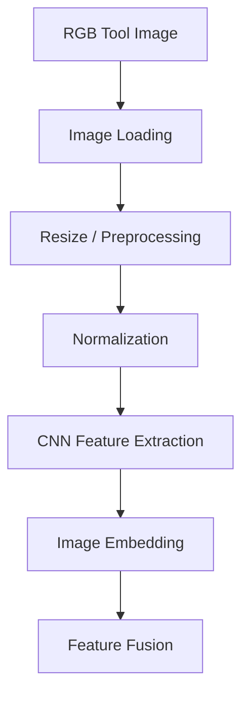

The project uses:

- PIL / Pillow
- Image preprocessing
- CNN
- Edge-based analysis
- Crop-based wear analysis

The visual pipeline focuses on extracting information associated with tool-edge degradation.

---

# 📡 Sensor Processing Pipeline

The sensor-processing pipeline handles machining signals.

The platform works with five important signal channels:

```text
┌─────────────────────────────────────────┐
│          SENSOR CHANNELS                │
├─────────────────────────────────────────┤
│                                         │
│  Fx      Cutting Force                  │
│  Fy      Feed Force                     │
│  Fz      Passive Force                  │
│  Accel   Vibration Acceleration         │
│  AE      Acoustic Emission              │
│                                         │
└─────────────────────────────────────────┘
```

Processing pipeline:

```text
Raw Sensor Data
      ↓
Data Validation
      ↓
Missing / Invalid Data Check
      ↓
Signal Quality Analysis
      ↓
Normalization
      ↓
1D-CNN
      ↓
Sensor Embedding
```

---

# ⚙️ Metadata Processing

The research pipeline can also incorporate machining parameters.

Examples include:

- Cutting speed
- Spindle speed
- Feed per tooth
- Feed velocity
- Radial depth
- Axial depth
- Workpiece material

The metadata pipeline is:

```text
Machining Parameters
        ↓
Data Cleaning
        ↓
Standardization
        ↓
Metadata Encoder
        ↓
Feature Representation
```

---

# 🔗 Feature Fusion

The multimodal model combines learned representations.

```text
┌────────────────────┐
│   Image Encoder    │
└─────────┬──────────┘
          │
          ▼
    Image Features
          │
          │
          ├───────────────┐
          │               │
          ▼               ▼
     FEATURE FUSION → Regression
          ▲               │
          │               ▼
          │          Wear Prediction
          │
    Sensor Features
          ▲
          │
┌─────────┴──────────┐
│  Sensor 1D-CNN     │
└────────────────────┘
```

The objective is to learn complementary information from different modalities.

---

# 📈 Wear Prediction

The final regression head produces a continuous estimate of tool flank wear.

Example:

```text
Predicted Flank Wear

        52.65 µm
           │
           ▼
       0.0526 mm
```

The prediction is then used by the application for health classification and maintenance analysis.

---

# 🔍 Explainable AI

## Why Explainability?

Industrial AI systems should not simply produce:

```text
Wear = 52.65 µm
```

They should also help answer:

> **Which part of the tool image influenced the prediction?**

ToolWear.AI integrates **Grad-CAM** for visual model interpretation.

---

# 🧠 Grad-CAM Pipeline

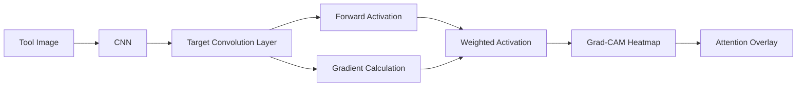

The interface displays:

### 1. Grad-CAM Heatmap

Shows areas associated with model activation.

### 2. Attention Overlay

Combines the heatmap with the original image.

### 3. Raw Optical Micrograph

Displays the original tool image for comparison.

---

# 🔬 Multimodal Agreement

ToolWear.AI includes a cross-stream verification concept.

The purpose is to compare evidence coming from different modalities.

```text
         Optical Evidence
               │
               ▼
         Image Features
               │
               │
               ├─────────────┐
               │             │
               ▼             ▼
          AGREEMENT      DISCREPANCY
               ▲             │
               │             │
               └─────────────┘
                     ▲
                     │
              Sensor Evidence
```

The dashboard provides a **Multimodal Agreement & Cross-Stream Verification** section.

Example:

```text
Multimodal Agreement

        51.5%

      Discrepancy Check
```

The system can compare image latent information and sensor latent information to identify agreement or discrepancy between the two streams.

---

# ❤️ Tool Health Monitoring

The predicted wear value is converted into an operational tool-health interpretation.

The dashboard provides:

- Current wear
- Tool life consumed
- Remaining cuts
- Health stage
- Prescriptive action

Example workflow:

```text
Predicted Wear
      ↓
Health Classification
      ↓
Tool Life Assessment
      ↓
Remaining Cuts
      ↓
Maintenance Recommendation
```

---

# 🚦 Health Classification

ToolWear.AI uses wear thresholds to communicate tool condition.

Conceptually:

```text
          TOOL CONDITION

0 µm
 │
 │      🟢 HEALTHY
 │
100 µm
 │
 │      🟡 MODERATE WEAR
 │
200 µm
 │
 │      🔴 CRITICAL
 │
300 µm
 │
 ▼
LIMIT
```

The exact displayed thresholds are configurable according to the application's tool-health logic.

---

# ⏳ Remaining Useful Life

The platform estimates remaining machining life based on the current wear condition.

```text
Current Wear
     ↓
Wear Consumption
     ↓
Estimated Remaining Life
     ↓
Remaining Machining Passes
```

Example dashboard information:

```text
Tool Life Consumed:        17.5%

Estimated Remaining Cuts: ~260 Passes

Health Stage:
Healthy

Maintenance:
Continue Normal Operation
```

---

# 📈 Wear Progression

ToolWear.AI tracks wear across machining passes.

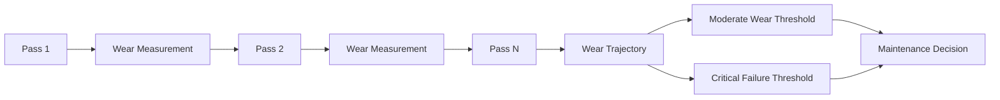

The trajectory interface provides:

- Machining pass index
- Flank wear
- Wear in millimeters
- Health index
- Wear status
- Timestamp
- Critical threshold
- Moderate threshold
- CSV export

---

# 📡 Sensor Quality Monitoring

A machine-learning model can only be trusted when the input signals are reliable.

ToolWear.AI therefore includes a dedicated sensor-quality monitoring interface.

The system evaluates:

- Signal variance
- Flatline behavior
- Zero drift
- Signal-to-noise ratio
- Channel activity
- High-frequency signal behavior

---

# 📊 Five-Channel Sensor Visualization

```text
┌─────────────────────────────────────────┐
│         HIGH-FREQUENCY SIGNALS          │
├─────────────────────────────────────────┤
│                                         │
│  🔵 Vibration Acceleration              │
│  🟠 Acoustic Emission                   │
│  🟢 Cutting Force Fx                    │
│  🟣 Feed Force Fy                       │
│  🔴 Passive Force Fz                    │
│                                         │
└─────────────────────────────────────────┘
```

Example dashboard status:

```text
Sensor Quality

98.4%

Telemetry Valid

Optimal Signal
High SNR – All 5 Channels Active
```

---
# 🔐 Authentication


The application includes an access portal for operator/engineer authentication.

The interface supports:

- Sign In
- Sign Up
- Operator / Engineer name
- Work email
- Password
- Shop-floor role
- Operator registration

Example role:

```text
CNC Floor Operator
```

---


# 🧪 Dataset

The project uses a controlled tool-wear benchmark organized around machining sets.

The dataset contains information representing:

- Tool-edge images
- Sensor measurements
- Machining parameters
- Wear measurements

The dataset is processed into a format suitable for multimodal deep learning.

---

# 🧹 Data Preprocessing

The preprocessing workflow is:

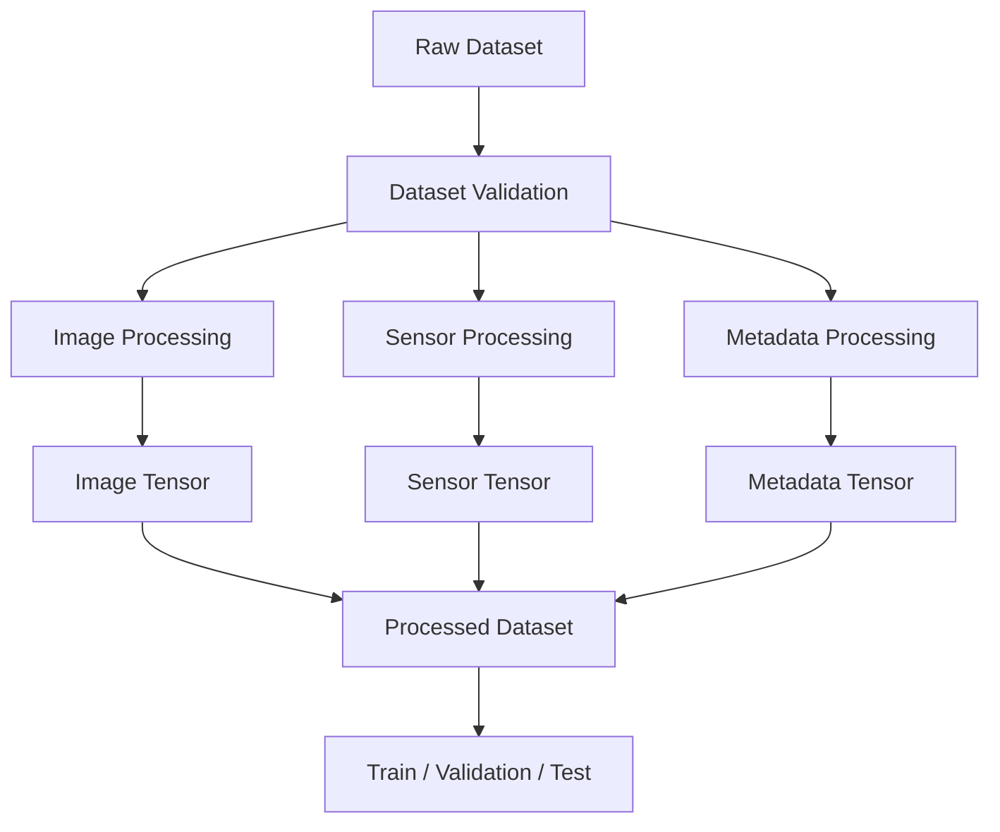

---

# 🖼️ Image Preprocessing

The image preprocessing pipeline includes:

- Image loading
- RGB processing
- Resizing
- Normalization
- Tool-edge analysis
- Crop-based wear analysis

The goal is to provide consistent image representations to the CNN.

---

# 📡 Sensor Preprocessing

Sensor data is processed before entering the 1D-CNN.

The process includes:

```text
Raw Signal
    ↓
Validation
    ↓
Channel Check
    ↓
Signal Quality
    ↓
Normalization
    ↓
1D-CNN
```

The five primary channels are:

```text
Fx
Fy
Fz
Acceleration
Acoustic Emission
```

---

# ⚙️ Metadata Preprocessing

Machining parameters are standardized using training-set statistics before being passed into the metadata encoder.

This prevents numerical scale differences from dominating the model.

---

# 🧪 Training Strategy

The dataset is divided by machining set rather than randomly splitting individual samples.

The documented split is:

| Split | Machining Sets | Samples |
|---|---|---:|
| Training | 01–06 | 360 |
| Validation | 07–08 | 120 |
| Testing | 09–10 | 120 |

This approach helps reduce leakage between different points belonging to the same machining progression.

---

# 🧠 Training Pipeline

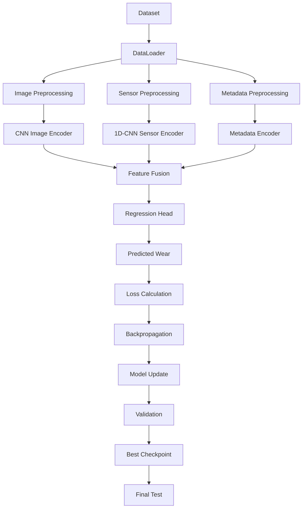

---

# 📊 Evaluation Metrics

ToolWear.AI uses standard regression metrics.

## MAE

**Mean Absolute Error**

Measures the average absolute difference between predicted and actual wear.

```text
Lower MAE = Better
```

---

## RMSE

**Root Mean Squared Error**

Penalizes larger prediction errors more heavily.

```text
Lower RMSE = Better
```

---

## R²

**Coefficient of Determination**

Measures how well the model explains the variance in the target.

```text
Higher R² = Better
```

---

# 📈 Results

The documented model evaluation reports:

| Metric | Result |
|---|---:|
| **R²** | **0.9938** |
| **MAE** | **3.09 µm** |
| **RMSE** | **4.29 µm** |

These results represent the documented benchmark evaluation of the model.

### Important

These numbers should **not** be interpreted as guaranteed production performance.

Real-world CNC environments can introduce differences in:

- Machines
- Tools
- Tool geometry
- Materials
- Cutting conditions
- Sensor placement
- Machine dynamics
- Environmental conditions

Therefore, additional real-world validation is required before production deployment.

---

# 🧪 Ablation Study

The multimodal architecture can be evaluated using different combinations of input modalities.

| Experiment | Input |
|---|---|
| Experiment 1 | Image Only |
| Experiment 2 | Sensor Only |
| Experiment 3 | Metadata Only |
| Experiment 4 | Image + Sensor |
| Experiment 5 | Image + Sensor + Metadata |

The purpose of the ablation study is to determine the contribution of each modality.

```text
                    MODEL COMPARISON

             ┌──────────────────────┐
             │      Image Only      │
             └──────────┬───────────┘
                        │
             ┌──────────▼───────────┐
             │      Sensor Only     │
             └──────────┬───────────┘
                        │
             ┌──────────▼───────────┐
             │     Metadata Only    │
             └──────────┬───────────┘
                        │
             ┌──────────▼───────────┐
             │   Image + Sensor     │
             └──────────┬───────────┘
                        │
             ┌──────────▼───────────┐
             │ Image + Sensor +     │
             │ Metadata             │
             └──────────────────────┘
```

---

# 🛠️ Technology Stack

## 🎨 Frontend

```text
React.js
Vite
Bootstrap
HTML5
CSS3
JavaScript
```

## ⚙️ Backend

```text
Python
Flask
REST API
JSON
```

## 🧠 Deep Learning

```text
PyTorch
CNN
1D-CNN
Multimodal Feature Fusion
Regression
```

## 🤖 Machine Learning

```text
Regression
MAE
RMSE
R²
```

## 👁️ Computer Vision

```text
PIL / Pillow
Image Preprocessing
Edge-Based Wear Analysis
Crop-Based Wear Analysis
Grad-CAM
```

## 📡 Sensor Processing

```text
NumPy
Pandas
Acceleration
Acoustic Emission
Fx
Fy
Fz
Signal Processing
Signal Quality Analysis
```

## 🔍 Explainability

```text
Grad-CAM
Visual Model Interpretation
Attention Visualization
```

## 🚀 Deployment

```text
PyTorch Model Inference
Docker
Docker Compose
Nginx
Git
GitHub
```

---

# 📁 Project Structure

```text
cutting-tool-wear-prediction-sih/
│
├── README.md
├── .gitignore
├── requirements.txt
├── config.json
│
├── labels.csv
├── processed_index.csv
├── preprocessing_artifacts.json
│
├── app.py
├── Dockerfile
├── docker-compose.yml
│
├── checkpoints/
│   └── image_sensor.pt
│
├── src/
│   ├── dataset.py
│   ├── model.py
│   └── train.py
│
├── notebooks/
│   ├── stage2_preprocessing.ipynb
│   └── image_preprocessing_visualization.ipynb
│
├── data/
│   ├── images/
│   ├── edge_images/
│   └── sensors/
│
├── outputs/
│   ├── checkpoints/
│   └── results/
│
├── previews/
│
├── frontend/
│   ├── package.json
│   ├── Dockerfile
│   ├── nginx.conf
│   │
│   ├── public/
│   │
│   └── src/
│       ├── App.jsx
│       ├── services/
│       │   └── api.js
│       └── ...
│
└── docs/
    └── screenshots/
        ├── dashboard.png
        ├── explainable-ai.png
        ├── wear-rul.png
        ├── sensor-quality.png
        └── login.png
```

---

# ⚙️ Backend Architecture

The backend is built using Python and Flask.

```text
                 Flask Backend
                       │
        ┌──────────────┼──────────────┐
        │              │              │
        ▼              ▼              ▼
 Authentication    Prediction      Analysis
        │              │              │
        │              ▼              │
        │        PyTorch Model         │
        │              │              │
        │              ▼              │
        │       Wear Prediction        │
        │              │              │
        └──────────────┼──────────────┘
                       │
                       ▼
                   JSON API
```

The backend handles:

- Authentication
- Input validation
- Model loading
- Image processing
- Sensor processing
- Model inference
- Wear prediction
- Health analysis
- Explainability
- API responses

---

# ⚛️ Frontend Architecture

The frontend is built using React and Vite.

```text
                    React App
                       │
        ┌──────────────┼───────────────┐
        │              │               │
        ▼              ▼               ▼
    Dashboard    Explainability    Wear / RUL
        │              │               │
        └──────────────┼───────────────┘
                       │
                       ▼
                   API Service
                       │
                       ▼
                 Flask Backend
```

The frontend provides the visualization and interaction layer for the AI system.

---

# 🔌 REST API

ToolWear.AI exposes backend functionality through REST APIs.

## Authentication

### Sign Up

```http
POST /api/signup
```

Used to register an operator or engineer.

### Sign In

```http
POST /api/signin
```

Used to authenticate users.

---

# 📈 Wear Prediction API

```http
POST /predict
```

The inference API accepts the required prediction inputs.

Conceptually:

```text
Tool Edge Image
      +
Sensor Signal
      +
Machining Pass
      ↓
POST /predict
      ↓
Flask
      ↓
PyTorch
      ↓
Wear Prediction
```

The returned information can be used by the frontend for:

- Predicted wear
- Health status
- Health score
- Maintenance action
- Explainability
- Multimodal analysis

---

# 📦 Installation

## 1. Clone Repository

```bash
git clone https://github.com/om-bhinsara/cutting-tool-wear-prediction-sih.git

cd cutting-tool-wear-prediction-sih
```

---

# 🐍 Backend Setup

Create a Python virtual environment.

## Windows

```bash
python -m venv venv

venv\Scripts\activate
```

## Linux / macOS

```bash
python3 -m venv venv

source venv/bin/activate
```

Install dependencies:

```bash
pip install -r requirements.txt
```

Run the backend:

```bash
python app.py
```

---

# ⚛️ Frontend Setup

Open another terminal.

Navigate to the frontend:

```bash
cd frontend
```

Install dependencies:

```bash
npm install
```

Start the development server:

```bash
npm run dev
```

The Vite development server will provide the local frontend address in the terminal.

---

# 🐳 Docker Deployment

ToolWear.AI also includes Docker configuration.

Build and run:

```bash
docker compose up --build
```

Architecture:

```text
                    Docker Compose
                          │
             ┌────────────┴────────────┐
             │                         │
             ▼                         ▼
       Flask Backend             React Frontend
             │                         │
             │                       Nginx
             │                         │
             └───────────┬─────────────┘
                         │
                      REST API
```

---

# ▶️ Running the Application

The complete workflow is:

```text
1. Start Flask Backend
          ↓
2. Start React Frontend
          ↓
3. Open ToolWear.AI
          ↓
4. Sign In
          ↓
5. Upload Tool Image
          ↓
6. Upload Sensor Signal
          ↓
7. Select Machining Pass
          ↓
8. Execute Multimodal Wear Prediction
          ↓
9. View Wear Prediction
          ↓
10. View Health Status
          ↓
11. View Maintenance Recommendation
          ↓
12. Inspect Grad-CAM
          ↓
13. Check Multimodal Agreement
          ↓
14. Track Wear Progression
```

---

# 🧑‍🏭 Typical User Workflow

A CNC floor operator can use the application as follows:

```text
                 CNC MACHINE
                     │
                     ▼
              Machining Process
                     │
        ┌────────────┴────────────┐
        │                         │
        ▼                         ▼
   Tool Image                 Sensors
        │                         │
        └────────────┬────────────┘
                     ▼
              ToolWear.AI
                     │
                     ▼
              AI Prediction
                     │
        ┌────────────┼────────────┐
        │            │            │
        ▼            ▼            ▼
      Wear        Health        RUL
        │            │            │
        └────────────┼────────────┘
                     ▼
            Maintenance Action
```

---

# ✨ Key Features

## 1. Multimodal Wear Prediction

Combines visual and sensor information.

## 2. Tool Edge Image Analysis

Analyzes optical images of cutting-tool edges.

## 3. Sensor Signal Processing

Processes acceleration, acoustic emission and cutting-force channels.

## 4. CNN-Based Computer Vision

Extracts visual wear features.

## 5. 1D-CNN Sensor Encoding

Extracts temporal information from machining signals.

## 6. Feature Fusion

Combines representations from multiple modalities.

## 7. Continuous Wear Regression

Predicts flank wear in micrometers.

## 8. Grad-CAM

Provides visual model interpretation.

## 9. Multimodal Agreement

Checks consistency between image and sensor evidence.

## 10. Tool Health Score

Converts predicted wear into a tool-health representation.

## 11. Remaining Useful Life

Provides estimated remaining machining passes.

## 12. Wear Progression

Tracks degradation over machining cycles.

## 13. Sensor Quality Monitoring

Checks telemetry quality before inference.

## 14. Maintenance Recommendations

Provides condition-based operational guidance.

## 15. CSV Export

Allows wear progression data to be exported.

## 16. Role-Based Access

Provides an operator/engineering-oriented authentication interface.

## 17. REST API

Separates the AI inference backend from the frontend.

## 18. Docker Deployment

Supports containerized deployment.

---

# 🎨 UI Design Philosophy

The interface is designed around industrial monitoring.

The UI emphasizes:

```text
Readability
     +
Operational Information
     +
AI Explainability
     +
Real-Time Status
     +
Predictive Maintenance
```

The dashboard uses clear visual states for:

- Healthy
- Warning
- Discrepancy
- Critical
- Online
- Telemetry Valid

The objective is to allow operators to understand the machine condition without needing to inspect raw model outputs.

---

# 🔬 Explainability Philosophy

The project follows the principle:

> **Prediction without explanation is not enough for an industrial AI system.**

Therefore, ToolWear.AI provides:

```text
Prediction
    +
Visual Explanation
    +
Sensor Evidence
    +
Cross-Stream Verification
    ↓
More Interpretable AI
```

---

# 🧩 Engineering Challenges

The project brings together several technically different areas.

## Challenge 1 — Multimodal Data

Images and sensor signals have fundamentally different structures.

```text
Image
2D Spatial Data

Sensor
1D Temporal Data
```

The solution is to use separate encoders before fusion.

---

## Challenge 2 — Sensor Reliability

Incorrect or low-quality telemetry can affect model inference.

The project therefore includes sensor-quality analysis.

---

## Challenge 3 — Model Explainability

A numerical prediction alone is difficult to interpret.

Grad-CAM provides visual evidence for image-based predictions.

---

## Challenge 4 — Data Leakage

Tool-wear samples can be correlated across machining progression.

Set-wise dataset splitting helps reduce leakage between related samples.

---

## Challenge 5 — Industrial Usability

A research model is not enough.

The project therefore includes:

- Dashboard
- Health score
- RUL
- Maintenance recommendation
- Sensor quality
- Wear trajectory
- Authentication
- REST API

---

## Domain Generalization

Performance may change across:

- CNC machines
- Cutting tools
- Tool geometries
- Workpiece materials
- Cutting parameters
- Coolant conditions
- Sensor placement
- Machine dynamics

## Production Deployment

Before deployment in a safety-critical industrial environment, the system should undergo extensive validation and monitoring.

---

# 🔮 Future Scope

## 🏭 1. Direct CNC Integration

Connect ToolWear.AI directly to CNC machines.

---

## 📡 2. Live Sensor Streaming

Replace file-based sensor upload with real-time streaming.

```text
CNC Machine
     ↓
Live Sensors
     ↓
Streaming Pipeline
     ↓
ToolWear.AI
     ↓
Real-Time Wear
```

---

## 🧠 3. Online Learning

Allow the model to learn from newly collected machining data.

---

## ⏳ 4. Advanced RUL Forecasting

Extend the system from current wear estimation toward future wear trajectory prediction.

---

## 🌍 5. Real-World Validation

Evaluate the system across:

- Different machines
- Different tools
- Different materials
- Different cutting conditions

---

## 📊 6. Larger Multimodal Dataset

Expand the training data with additional machining scenarios.

---

## 🤖 7. Automated Maintenance Scheduling

Connect wear predictions to maintenance-management systems.

---

## 📱 8. Mobile Monitoring

Future versions could provide mobile alerts for:

- Critical wear
- Sensor failure
- Maintenance requirements
- Tool replacement

---

# 📌 Project Status

| Component | Status |
|---|---|
| React Frontend | ✅ Implemented |
| Vite Application | ✅ Implemented |
| Flask Backend | ✅ Implemented |
| PyTorch Inference | ✅ Implemented |
| CNN Image Encoder | ✅ Implemented |
| 1D-CNN Sensor Encoder | ✅ Implemented |
| Multimodal Feature Fusion | ✅ Implemented |
| Wear Regression | ✅ Implemented |
| Grad-CAM | ✅ Implemented |
| Multimodal Agreement | ✅ Implemented |
| Tool Health Score | ✅ Implemented |
| Wear Progression | ✅ Implemented |
| RUL / Remaining Cuts | ✅ Implemented |
| Sensor Quality Monitoring | ✅ Implemented |
| REST API | ✅ Implemented |
| Docker Configuration | ✅ Implemented |
| GitHub Repository | ✅ Available |
| Demo Video | ✅ Available |
| Real-World Industrial Validation | 🔬 Future Work |

---

# 🎥 Demo

## ▶️ Project Demonstration

Watch the ToolWear.AI demonstration on YouTube:

**ToolWear.AI Project Demo**

https://youtu.be/e6yPnD5TcGQ?si=Bip5dLqUV19i1lYC


# 🗺️ Complete Project Pipeline

The entire project can be summarized as:

```text
                    ┌───────────────────────┐
                    │     CNC MACHINE       │
                    └───────────┬───────────┘
                                │
               ┌────────────────┼────────────────┐
               │                │                │
               ▼                ▼                ▼
          TOOL IMAGE         SENSORS        PARAMETERS
               │                │                │
               ▼                ▼                ▼
         IMAGE PROCESSING  SIGNAL PROCESSING  METADATA
               │                │                │
               ▼                ▼                ▼
             CNN              1D-CNN          ENCODER
               │                │                │
               └────────────────┼────────────────┘
                                │
                                ▼
                       MULTIMODAL FUSION
                                │
                                ▼
                       REGRESSION HEAD
                                │
                                ▼
                       FLANK WEAR (µm)
                                │
          ┌─────────────────────┼─────────────────────┐
          │                     │                     │
          ▼                     ▼                     ▼
      HEALTH SCORE             RUL             MAINTENANCE
          │                     │                     │
          └─────────────────────┼─────────────────────┘
                                │
                                ▼
                         EXPLAINABILITY
                                │
                    ┌───────────┴───────────┐
                    │                       │
                    ▼                       ▼
                 Grad-CAM            Sensor Analysis
                    │                       │
                    └───────────┬───────────┘
                                │
                                ▼
                       REACT DASHBOARD
                                │
                                ▼
                       OPERATOR / ENGINEER
```

# ⚙️ Final Summary

ToolWear.AI combines **computer vision, sensor processing, deep learning, multimodal feature fusion and explainable AI** into a unified CNC tool-health platform.

The system transforms:

```text
RAW MACHINING DATA
        ↓
IMAGE + SENSOR + PARAMETERS
        ↓
DEEP LEARNING
        ↓
MULTIMODAL FUSION
        ↓
TOOL WEAR PREDICTION
        ↓
HEALTH ASSESSMENT
        ↓
RUL ESTIMATION
        ↓
EXPLAINABLE AI
        ↓
MAINTENANCE DECISION
```

The ultimate goal is to move CNC manufacturing toward:

> **Data-driven, explainable and predictive tool maintenance.**

---

<p align="center">

# ⚙️ ToolWear.AI

### See the Wear. Understand the Signal. Predict the Future.

<br>

<strong>
Multimodal AI for Intelligent CNC Tool-Wear Prognostics
</strong>

<br><br>

Made with using React • Flask • PyTorch • CNN • 1D-CNN • Multimodal AI

</p>
